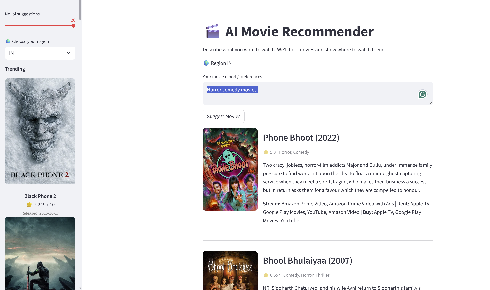

# 🎬 AI Movie Recommendation System

## Overview
An advanced movie recommendation system powered by **TMDB API**, **LangChain**, **LlamaIndex**, **FAISS**, and **Streamlit**.  
It understands natural language movie preferences and retrieves the most relevant movies using semantic search and TMDB filters.  
Includes integrated “Where to Watch” links using TMDB’s official watch providers.

---

## 🚀 Features

- 🧠 **Natural Language Understanding** — Describe your mood or preference (“Feel-good sci-fi movies like Interstellar”)  
- 🎞️ **TMDB Integration** — Fetches live movie data and metadata  
- 🔍 **Semantic Search (FAISS + LlamaIndex)** — Embeds and ranks movies by similarity to your query  
- 🦙 **LangChain LLM Query Parsing** — Converts natural text → TMDB-compatible filters  
- 🎥 **Where to Watch** — Shows streaming providers (Netflix, Disney+, etc.) via TMDB’s watch providers API  
- 🖥️ **Streamlit UI** — Clean, interactive frontend for exploration  

---

## 🧩 Tech Stack

| Layer | Technology |
|-------|-------------|
| Language | Python 3.10+ |
| Frontend | Streamlit |
| LLM Framework | LangChain |
| Embedding Engine | LlamaIndex (HuggingFace Embeddings) |
| Vector Database | FAISS |
| Movie Data Source | TMDB API |
| Environment | Virtualenv / Conda |

---

